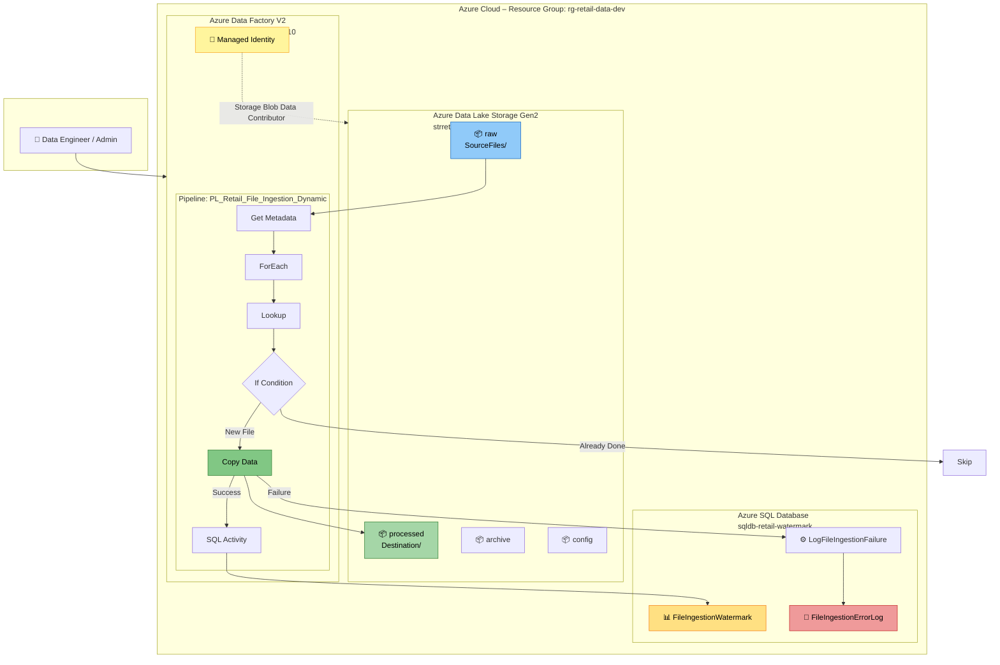
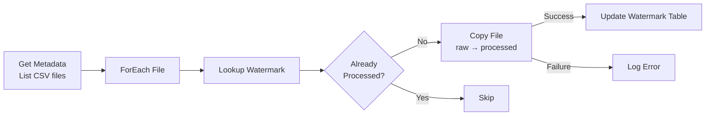
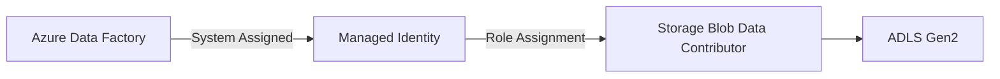

# ADF Retail Data Ingestion – Architecture Diagram

## High-Level Architecture

```mermaid
flowchart TB
    subgraph Client[" "]
        User["👤 Data Engineer / Admin"]
    end

    subgraph Azure["Azure Cloud – Resource Group: rg-retail-data-dev"]
        
        subgraph Storage["Azure Data Lake Storage Gen2<br/>strretaildata202610"]
            direction LR
            RAW["📦 raw<br/>SourceFiles/"]
            PROC["📦 processed<br/>Destination/"]
            ARCH["📦 archive"]
            CONF["📦 config"]
        end

        subgraph ADF["Azure Data Factory V2<br/>adf-retail-data-dev202610"]
            direction TB
            MI["🔐 Managed Identity"]
            
            subgraph PL["Pipeline: PL_Retail_File_Ingestion_Dynamic"]
                direction LR
                GM["Get Metadata"]
                FE["ForEach"]
                LK["Lookup"]
                IF{"If Condition"}
                CP["Copy Data"]
                SQLA["SQL Activity"]
            end
        end

        subgraph SQLDB["Azure SQL Database<br/>sqldb-retail-watermark"]
            direction TB
            WM["📊 FileIngestionWatermark"]
            ERR["🚨 FileIngestionErrorLog"]
            SP["⚙️ LogFileIngestionFailure"]
        end
    end

    User --> ADF
    RAW --> GM
    GM --> FE
    FE --> LK
    LK --> IF
    IF -->|New File| CP
    IF -->|Already Done| Skip["Skip"]
    CP -->|Success| SQLA
    CP -->|Failure| SP
    SQLA --> WM
    SP --> ERR
    CP --> PROC
    MI -.->|Storage Blob Data Contributor| Storage

    style RAW fill:#90CAF9,stroke:#1565C0,color:#000
    style PROC fill:#A5D6A7,stroke:#2E7D32,color:#000
    style WM fill:#FFE082,stroke:#F57F17,color:#000
    style ERR fill:#EF9A9A,stroke:#C62828,color:#000
    style CP fill:#81C784,stroke:#2E7D32,color:#000
    style MI fill:#FFF59D,stroke:#F9A825,color:#000
```

## Incremental Load Flow

```mermaid
flowchart LR
    A[Get Metadata<br/>List CSV files] --> B[ForEach File]
    B --> C[Lookup Watermark]
    C --> D{Already<br/>Processed?}
    D -->|No| E[Copy File<br/>raw → processed]
    D -->|Yes| F[Skip]
    E -->|Success| G[Update Watermark Table]
    E -->|Failure| H[Log Error]
```

## Security Flow

```mermaid
flowchart LR
    ADF[Azure Data Factory] -->|System Assigned| MI[Managed Identity]
    MI -->|Role Assignment| Role[Storage Blob Data Contributor]
    Role --> ADLS[ADLS Gen2]
```
